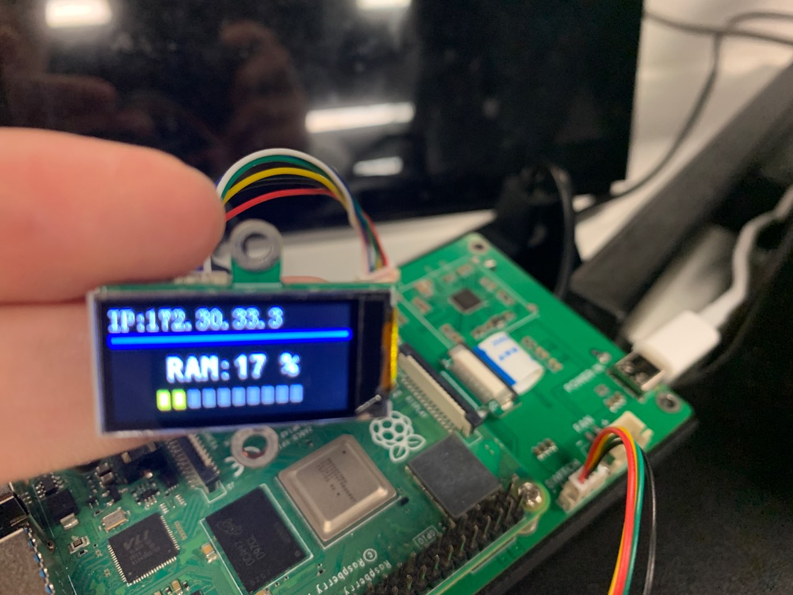

1. 点击 :配置 -> 加载项

   

2. 进入加载项页面,点击 加载项商店

   

3. 进入加载项商店,点击 右上角红框标注的菜单按钮

   

4. 点击仓库

    

5. 弹出添加仓库,输入仓库地址 https://github.com/UCTRONICS/U6143_HA ,点击添加,可以在3处看到添加的仓库

    

6. 返回加载项商店,点击检查更新.

   

7. 可以查看到刚刚添加的仓库和加载项

   

8. 点击要安装的加载项,等待安装成功后,禁止保护模式然后启动.

   

9. 然后可以看到 **lcd** 屏显示信息

   

