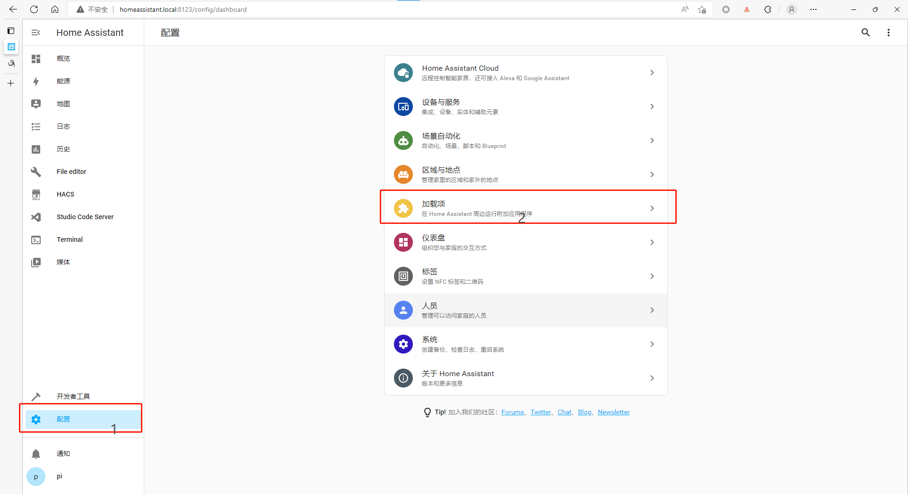
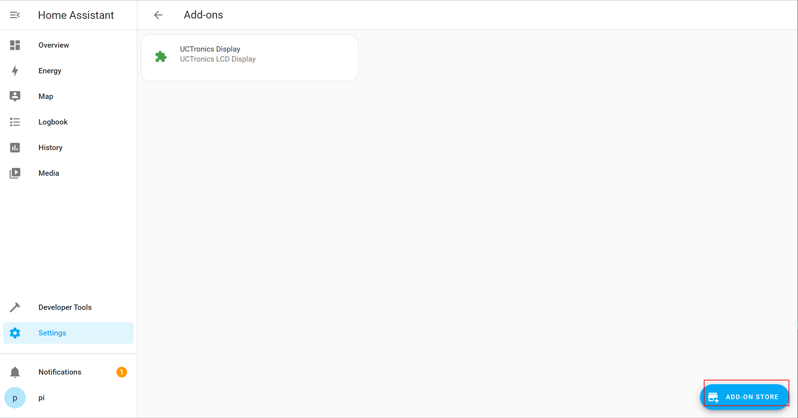
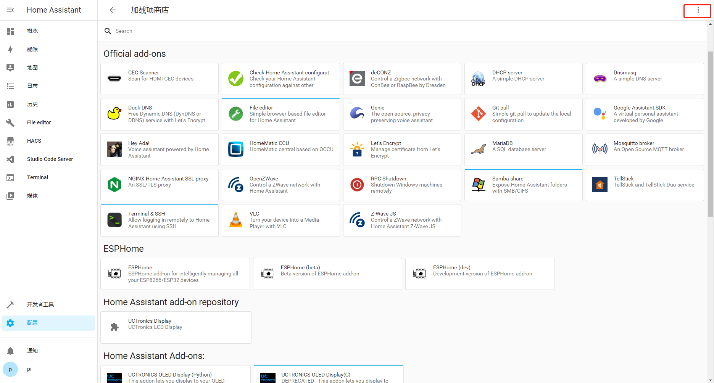
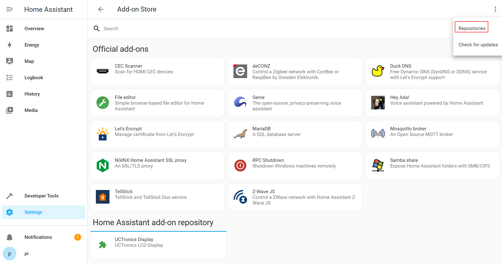
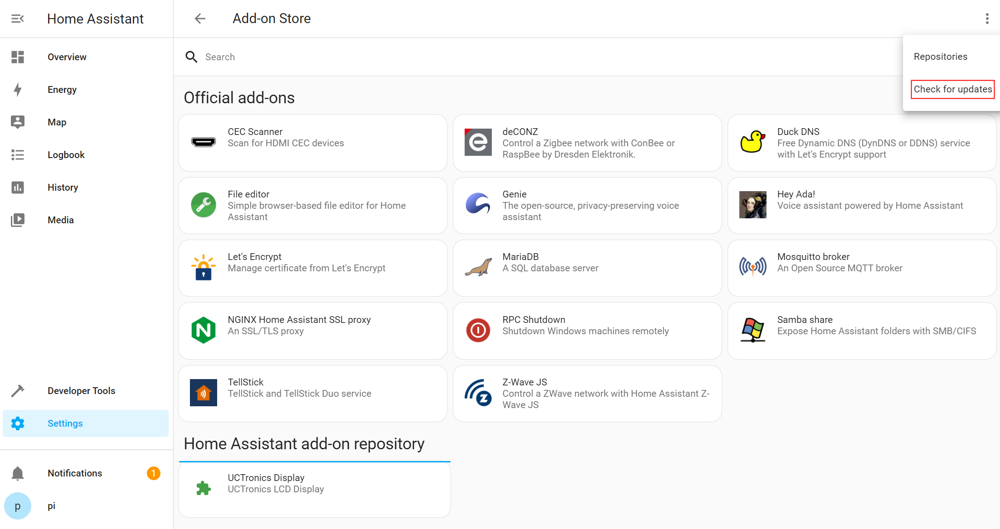
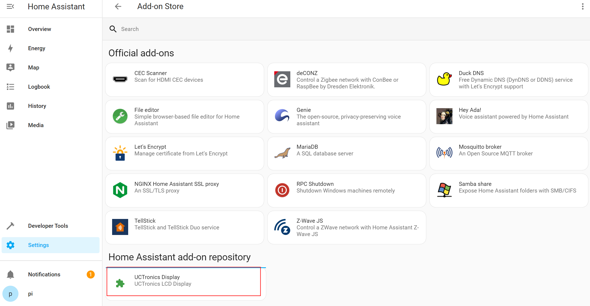
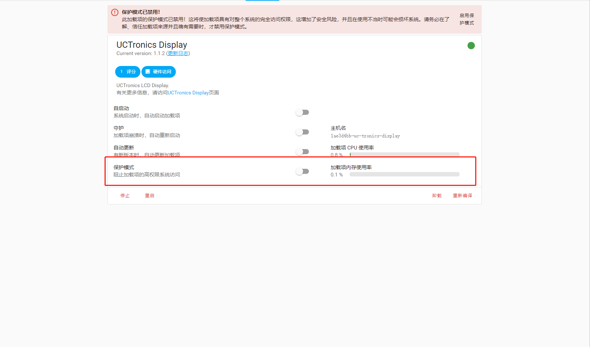
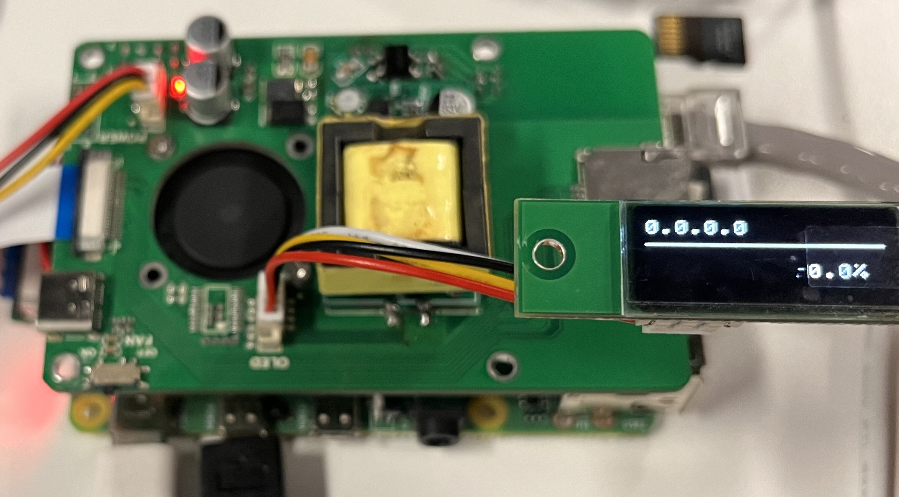

# Use the tutorial

1. click : Settings -> Add-Ons.

   

2. Go to the add-ons page, click **ADD ON STORE.**

   

3. Enter the add on store, click the menu button marked with the red box in the upper right corner.

   

4. Click **Repositories**

    

5. Pop-up Add repositories, enter the repositories address <https://github.com/UCTRONICS/U6143_HA> ,Click to **ADD**.

    

6. Go back to the add-on store and click Check for **Updates**.

   

7. You can view the repositories and add-ons added.

   

8. Click on the add-on you want to install, wait for the installation to succeed, disable **Protection mode** and start it.

   

9. Then you can see the information displayed on the lcd screen.

   
